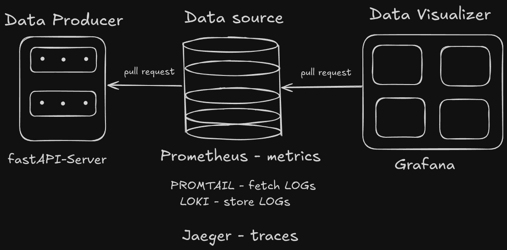
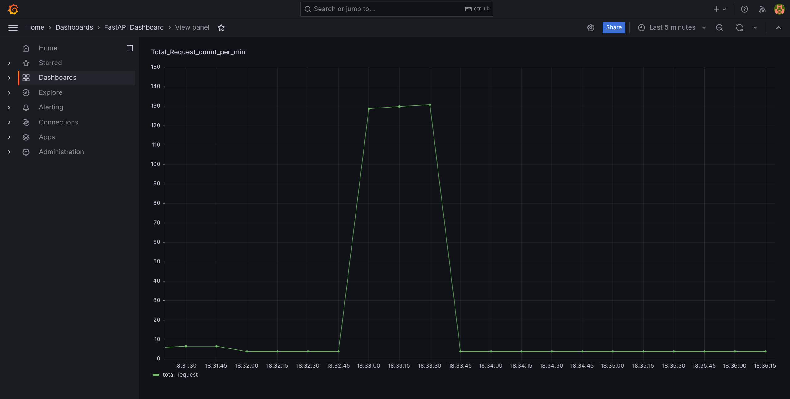
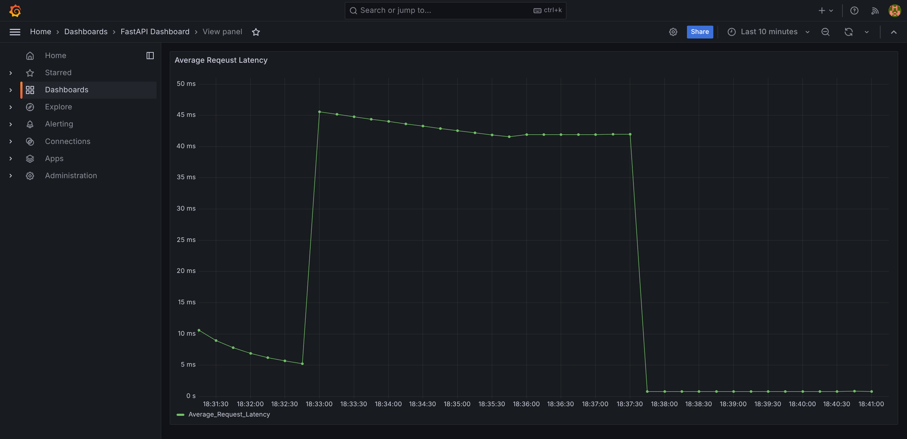
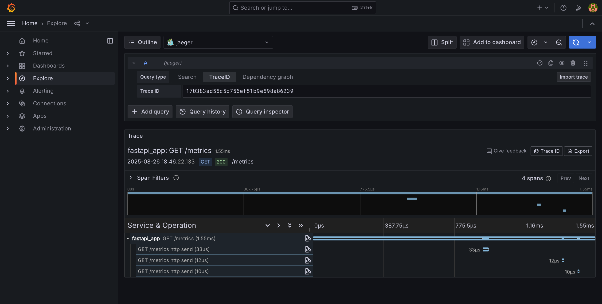
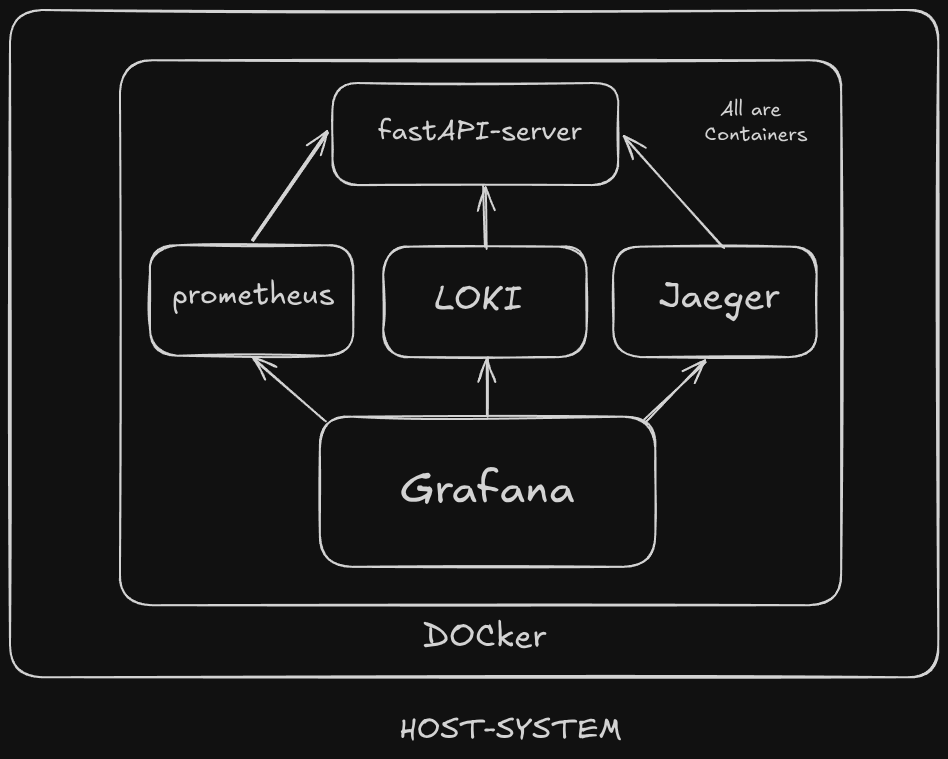
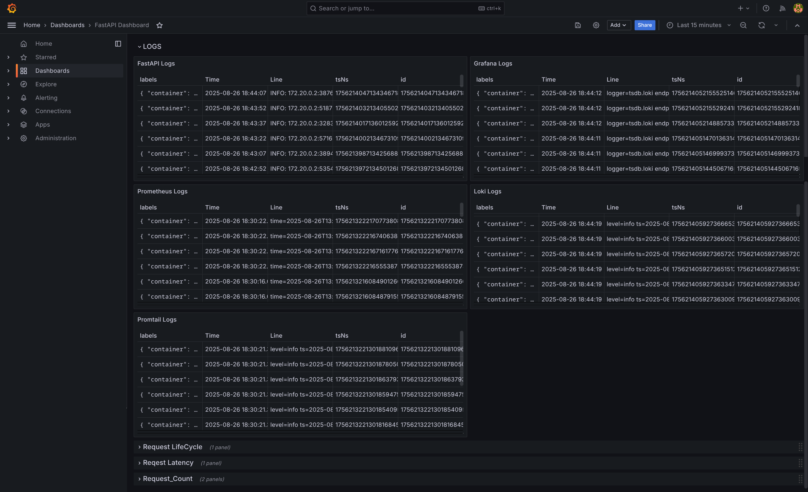

# FastAPI Monitoring Stack
A complete monitoring stack for FastAPI applications using Docker, Prometheus, Grafana, Loki, Jaeger, and OpenTelemetry. This project provides real-time metrics, distributed tracing, and log aggregation for your FastAPI.

## Features
- **FastAPI**: High-performance Python web framework.
- **Prometheus**: Metrics collection and monitoring.
- **Grafana**: Visualization of metrics and logs.
- **Loki & Promtail**: Centralized log aggregation.
- **Jaeger**: Distributed tracing for request flows.
- **OpenTelemetry**: Instrumentation for metrics and traces.
- **Docker Compose**: Easy orchestration of all services.

## Architecture


- FastAPI app exposes metrics and traces.
- Prometheus scrapes metrics from FastAPI.
- Grafana visualizes metrics and logs from Prometheus and Loki.
- Loki aggregates logs collected by Promtail from Docker containers.
- Jaeger receives traces from FastAPI via OpenTelemetry.

## Directory Structure
```
code/                # FastAPI app, Dockerfile, requirements
prometheus/          # Prometheus config
loki/                # Promtail config
assets/              # Architecture and metrics diagrams
vibe_venv/           # Python virtual environment (local)
docker-compose.yml   # Orchestration of all services
```

## Getting Started
### Prerequisites
- Docker & Docker Compose

### Quick Start
1. **Clone the repository**
	```sh
	git clone https://github.com/primegen-git/fastapi-monitoring-stack.git
	cd fastapi-monitoring-stack
	```
2. **Build and start all services**
	```sh
	docker-compose up --build
	```
3. **Access the services:**
	- FastAPI: [http://localhost:8000](http://localhost:8000)
	- Prometheus: [http://localhost:9090](http://localhost:9090)
	- Grafana: [http://localhost:3000](http://localhost:3000)
	- Jaeger: [http://localhost:16686](http://localhost:16686)

### Endpoints
- `/` : Basic welcome endpoint
- `/metrics` : Prometheus metrics endpoint

### Testing
You can use the provided `test.sh` script to generate load:
```sh
bash test.sh
```

## Monitoring & Observability
- **Metrics**: Prometheus scrapes `/metrics` from FastAPI. View in Prometheus or Grafana.
- **Tracing**: Jaeger UI shows distributed traces for requests.
- **Logs**: Loki aggregates logs; view in Grafana.

## Customization
- Edit `code/main.py` to add more endpoints or custom metrics.
- Update `prometheus/prometheus.yml` for scrape configs.
- Modify `loki/promtail-config.yml` for log sources.

## Screenshots





